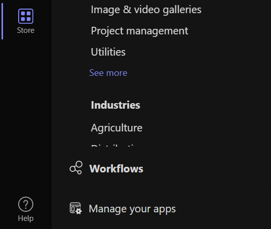
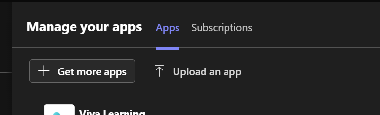

# Teams stuff

In the Teams folder there are 3 files

* **color.png** - the colorful icon that teams will display for your bot on cards
* **outline.png** - 1 transparency that will be used to pin your icon to the side channel
* **manifest.json** - the metadata about your bot that teams wants

# manifest.json 

The manifest describes all of the data teams needs to interact with your crazor based bot.

## Edit extension metadata

The extension metadata describes your bot and information about you as a developer

1. **Set the $.id to your bot Id **
2. **update name, developer info**

manifest.json 

## **Update bot section**

This enables your bot to receive and response to messages. 

1. update botId with your BotId = **MicrosoftAppId**

## Update compose extensions section for link unfurling

This enables your bot to unfurl your web site links into cards.

1. update **BotId** = **MicrosoftAppId**
2. update the **composeExtensions[].messageHandlers.domains** => domain for your web site to link unfurl
3. add your web site domain to **validDomains**

## Update commands section to set up cards as Task Modules

Register custom commands for cards as a task module

For each card you want to surface as custom command that shows as a **Task Module**

1. Set **Id = ** *path to your card* (Example: "**/Cards/Addresses/Add**")
2. context one or more of 
   1. **compose** (for inserting card into edit box)
   2. **commandBox** (for starting card from command box)
   3. **message** (for starting card from context of a message)

## Update staticTabs to define card as Tab Modules

Register static tabs with card as a tab module:

For each card you want to have be a tab add a section to **staticTabs**

1. set **entityId** => *path to your card* (Example: "**/Cards/Addresses**")
2. set **contentBotId** => Your **MicrosoftAppId**

# Deployment

Zip **all 3 files** up into a .zip file and import into teams and you can chat with your bot/link unfurl, etc.

1. go to Teams Store
2. Click on **Manage your Apps**
3. Click on Upload an App
4. When it comes up, click on **ADD TO TEAMS**

You should now be able to do link unfurling and commands for your crazor based project.
