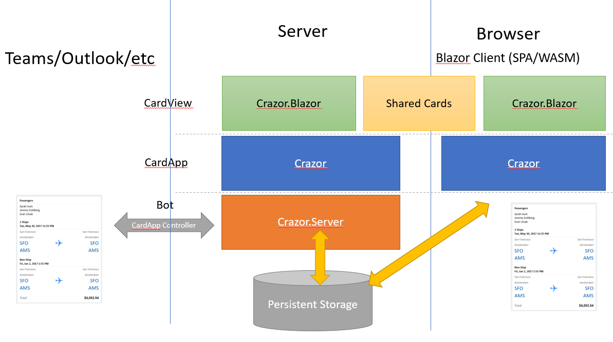

# Architecture

Crazor is made using layers so you can mix and match use just the parts you need.

## Libraries

Crazor is made up of 5 libraries

* **Crazor** - Defines the CardApp application programming model independent of hosting.  It needs ICardView implementations to create Cards.
* **Crazor.Server** - Defines a Controller and IBot which implements all of the hosting infrastructure for serving up a Crazor App in Teams/Outlook.
* **Crazor.Mvc** - Defines a implementation of ICardView which uses **.cshtml** template files to define cards.
* **Crazor.Blazor** - Defines a implementation of ICardView which uses **.razor** template files to define cards.
* **Crazor.Test** - Defines infrastructure for you to write unit tests for your cards.

## Crazor Server hosting CardApps

The Crazor is running on a server and servicing any of the CardApps defined there.  The 2 mechanisms for interaction are:

* **CardAppController** - When the card is running a s teams/outlook/office integration, the card UI is delivered via the CardAppController to the client. All rendering is client side and all logic is running server side.
* **Card Host Page** - When someone navigates to the card app host page the card is is hosted via HTML, with all rendering client side and all logic running server side.

This is true regardless of the ICardView implementation that is being used to turn templates into cards.

## Blazor Boxology

If you are using Blazor purely server side it's the exact same boxology, only you are using **Crazor.Blazor** to define your templates.

If you are using Blazor as WASM/SPA client then it looks like this:

Your card templates (razor files) are in a shared assembly which are consumed by the server when servicing calls from Teams/Outlook and are consumed and run **locally in the browser** via the magic of WASM.  ***Without changing a line of code!***

