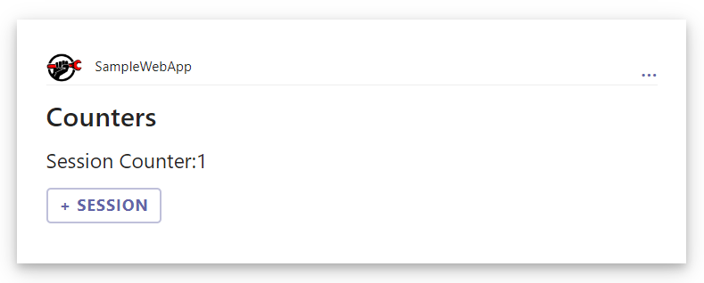
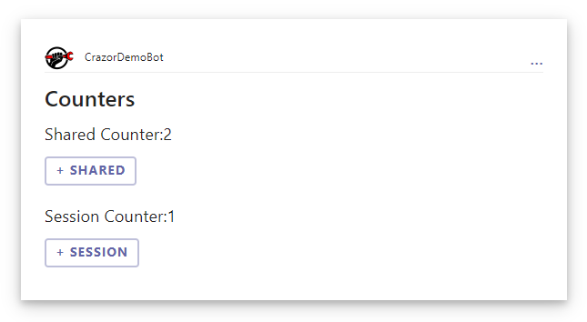

# Counters example walkthrough

We are going to create a data binding sample application which increments counters. It will show

* **[SharedMemory] and [SessionMemory] attributes**
* **Hooking verbs to methods**

## 1. Create Counters folder for your app in /cards

The **Cards** folder is a special folder that creates an area for your applications to live (just like Pages organizes your web pages). 

The convention is that each app is a sub-folder in the Cards folder, so we create a folder **/Cards/Counters**

## 2. Create a Default.razor file

Just like with HelloWorld, the CountersApp will load the **Default.razor** file as the initial view for the application, but this time we are going to 

* Display the value of **Counter**  property
* Add **verb handler** that increment the value of the counter.

Create **/Cards/Counters/Default.razor**

```xml
@inherits CardView

<Card Version="1.5">
    <TextBlock Size="ExtraLarge" Weight="Bolder">Counters</TextBlock>
    <TextBlock Size="Large">Session Counter:@Counter</TextBlock>

    <ActionExecute Title="+ Session" Verb="@nameof(OnIncrement)" />
</Card>

@code {
    public int Counter { get; set; }

    public void OnIncrement() => Counter++;
}
```

Things to notice:

* ```@inherits CardView``` defines that our card view is a Crazor CardView class.
* The local property **Counter** is automatically persisted with session scope as part of the card view. 
* We have OnIncrement() method hooked up to the ActionExecute verb.  

That's it.  Now run the application and go to the Counters app.

You should see something like this:



As you click on it, the card is refreshing itself and updating the values.  If you copy and paste the link to another browser window you will see that the session values are per window.

# Adding a custom CardApp 

By default we have a CardApp which does all of the bookkeeping for managing the card views. 

Now we will are going to create a custom CardApp which will have a shared counter which is shared among all viewers of the card.

* **View.Counter** => Is a value which each person who interacts with the card sees.
* **App.SharedCounter** => will be a value that all people who interact with the card see and share.

## 1. Create a CountersApp.cs file

We are going to define a **CountersApp** class which derives from **CardApp**.  We use this class to define properties and methods which all templates in the folder have access to. Depending on the **MemoryAttribute** applied the value will automatically be persisted according to the scope policy of the memory attribute.

In this case we are going to use **[AppMemory]** attribute because it scopes the memory to all users who interact with the card.

Create  **/Cards/Counters/CountersApp.cs** and define **CountersApp**

```C#
    public class CountersApp : CardApp
    {
        public CountersApp(IServiceProvider services): base(services)
        { }

        [AppMemory]
        public int SharedCounter { get; set; } = 0;
    }
```

The SharedCounter property defined on the **CountersApp** has a attribute **[AppMemory]** to signify that this value is shared by all users of the app. [(go to Memory documentation for more details)](/docs/Memory.md)

This illustrates the intelligent memory system that Crazor supports. Instead of dealing with the logic of loading various objects based on the keys you can simply put attributes on your properties to define the scope of the persistence for the value.

## 2. Update the Default.razor file to know about CountersApp

Now we will modify the **Default.razor** to interact with the **CountersApp.**

* Change the **default.razor** inherits statement to **@inherits CardView&lt;CountersApp&gt;** .  This tells the CardView that the **App** property is of type **CountersApp**

* Update to bind to **App.SharedCounter** and add a verb handler to increment it.

**/Cards/Counters/Default.razor** should look like this

```xml
@using CrazorDemoBot.Cards.Counters
@inherits CardView<CountersApp>

<Card Version="1.5">
    <TextBlock Size="ExtraLarge" Weight="Bolder">Counters</TextBlock>
    <TextBlock Size="Large">Session Counter:@Counter</TextBlock>
    <TextBlock Size="Large">Shared Counter:@App.SharedCounter</TextBlock>
    
    <ActionExecute Title="+ Session" Verb="@nameof(OnIncrement)" />
	<ActionExecute Title="+ Shared" Verb="@nameof(OnIncrementShared)"/>
</Card>

@code {
    public int Counter { get; set; }

    public void OnIncrement() => Counter++;
    public void OnIncrementShared() => App.SharedCounter++;
}
```

Things to notice:

* The local property **Counter** is automatically persisted with **session scope** as part of the card view. 
* The **App** property **SharedCounter** is persisted with **app scope** as part of the card application.

You should see something like this:




# Next Steps

* [Create an app with actions](CountersWalkthrough.md)

# More information

* [Card Views](CardView.md) - How to define views with **CardView** with **Blazor**
* [Card Apps](../CardApp.md) - How to create a **CardApp** class to define state and operations against state.
  * [Card App Memory](../Memory.md) - Information on persistence and memory model
* [Card Routing](../RoutingCards.md) - Information on customizing urls to support deep linking into cards
* [Authentication](../Authentication.md) - Authenticating users and Authorizing access to create per-user secure views
* [Writing Unit tests](../UnitTests.md) - Writing unit tests for your cards.
* [Components (Advanced)](Components.md) - How to define reusable components via Blazor Components


