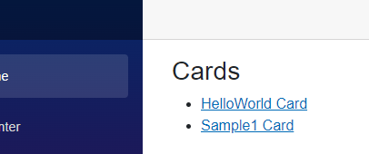

# Creating a new app 

We are going to create a card application called **Sample1**

## 1. Create a folder for your app Sample1

The **Cards** folder is a special folder that creates an area for your applications to live (just like Pages organizes your web pages). 

The convention is that each app is a sub-folder in the Cards folder, so we create a folder in **/Cards/Sample1**

## 2. Create a Default.razor file

By default Crazor will load the **Default.razor** file as the initial view for the application represented by the folder for https://host/Cards/Sample1

**/Cards/Sample1/Default.razor**

```xml
@inherits CardView
<Card Version="1.5">
    <TextBlock>Hello world!</TextBlock>
</Card>
```

That's it.  Now run the application and you should see this:



And if you click on the **Sample1** it takes you to **/Cards/Sample1** and you should see your card view:


# Next Steps

* [Create an app with actions](CountersWalkthrough.md)

# More information

* [CardView with Blazor](CardView.md) - details on how to use Crazor.Blazor to author CardViews

  


