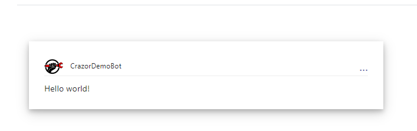

# Hello World walkthrough

We are going to create a HelloWorld card application.

## 1. Create a folder for your app

The **Cards** folder is a special folder that creates an area for your applications to live (just like Pages organizes your web pages). 

The convention is that each app is a sub-folder in the Cards folder, so we create a folder **/Cards/HelloWorld**

## 2. Create a Default.razor file

By default Crazor will load the **Default.razor** file as the initial view for the application represented by the folder.

**/Cards/HelloWorld/Default.razor**

```xml
@inherits CardView
<Card Version="1.5">
    <TextBlock>Hello world!</TextBlock>
</Card>
```

That's it.  Now run the application and go to http://localhost:{yourport}**/Cards/HelloWorld** 

You should see something like this:



