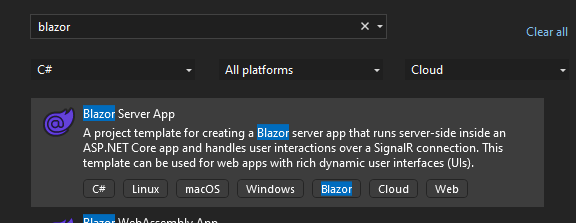
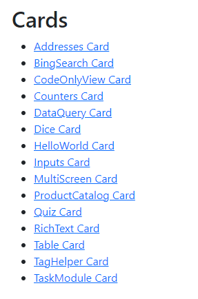

# Adding Crazor.Blazor 

Adding **Crazor.Blazor** is super easy.  Take a stock Blazor Server project and add the **Crazor.Blazor** package.



## Add Crazor.Blazor package to Server

>  **NOTE: Currently Crazor.Blazor is only published to an internal Microsoft devops nuget feed.  To connect to this feed, add a nuget.config in the root of your project with the following:**

```xml
<?xml version="1.0" encoding="utf-8"?>
<configuration>
  <packageSources>
    <clear />
    <add key="Crazor" value="https://fuselabs.pkgs.visualstudio.com/c861868a-1061-43d1-8232-ed9ab373867c/_packaging/Crazor/nuget/v3/index.json" />
  </packageSources>
</configuration>
```

Then you can add the **Crazor.Blazor** package

```shell
nuget add package Crazor
nuget add package Crazor.Blazor
nuget add package Crazor.Server
```

And register crazor in your **program.cs** :

```c#
builder.Services.AddCrazor();
builder.Services.AddCrazorServer();
builder.Services.AddCrazorBlazor();
...
app.UseCrazorServer();
```


## Add IStorage provider

The default IStorage provider is the volitile MemoryStorage where all data is simple stored in memory and lost when you restart the process. 

To deploy a service you need a real IStorage provider. Here's how to add the Azure Blob IStorage implementation:

```shell
nuget add Microsoft.Bot.Builder.Azure.Blobs
```

Adding to your **program.cs**:

```C#
var storageKey = builder.Configuration.GetValue<string>("AzureStorage");
if (storageKey != null)
	builder.Services.AddSingleton<IStorage, BlobsStorage>(sp => new BlobsStorage(storageKey, "mybot"));
```


## Add Bot Controller on Blazor Server

Crazor requires that a bot controller for integrating with Teams/Office, etc. To do that in a blazor project you need to add:

```C#
builder.Services.AddControllers();
...
app.UseStaticFiles();
app.UseRouting();
app.MapControllers();
```


# Modifications to your Project

## Create Cards folder

1. add a **Cards** folder (should be a peer to **Pages** folder)

2. Create a **Cards/_Imports.razor** file containing default namespaces:

   ```C#
   @using Crazor
   @using Crazor.AdaptiveCards
   @using Crazor.Attributes
   @using Crazor.Blazor
   @using Crazor.Blazor.Components.Adaptive;
   @using Crazor.Exceptions
   @using Crazor.Teams;
   @using System.ComponentModel.DataAnnotations;
   @using System.Threading;
   @using System.Threading.Tasks;
   ```

## Modify /App.razor 

You need to add a reference to **Crazor.Blazor** assembly by setting **AdditionalAssemblies** in your App.Razor file:

```html
<Router AppAssembly="@typeof(App).Assembly" 
        AdditionalAssemblies="@(new[] { typeof(Crazor.Blazor.Pages.Cards).Assembly})">
```

This adds razor pages defined **Crazor.Blazor** package, specifically the page that hosts a card for a given route.

## Settings

(REQUIRED) Look at [Settings](../Settings.md) page for information settings for your project 

## Modify Pages/_Host.cshtml or Pages/_Layout.cshtml
You need to add adaptive card javascript to the header of either _Host.csthml or _Layout.cshtml

```html
<head>
...
    <!-- CRAZOR -->
    <script src="https://ajax.googleapis.com/ajax/libs/jquery/3.3.1/jquery.min.js"></script>
    <script src="https://unpkg.com/adaptivecards@latest/dist/adaptivecards.min.js"></script>
    <script src="https://unpkg.com/markdown-it/dist/markdown-it.js"></script>
    <script type="text/javascript" src="~/js/hostconfig.js"></script>
    <style>
        .cardDiv {
            width: 640px;
            margin: 10px;
            box-shadow: 0 4px 8px 0 rgba(0, 0, 0, 0.2), 0 6px 20px 0 rgba(0, 0, 0, 0.19);/
            text-align: center;
        }

        .row {
            display: flex;
            flex-wrap: wrap;
            padding: 0 4px;
        }

        .column {
            flex: 25%;
            max- width: 33.3%;
            padding: 0 4px;
        }
    </style>
    <link rel="stylesheet" type="text/css" href="https://adaptivecards.io/node_modules/adaptivecards-designer/dist/containers/teams-container-light.css">
    <!--CRAZOR -->
...
</head>
```

# (Optional) Modify index.razor to enumerate your card apps

Insert this the content of your **Index.razor**

```html
@page "/"
@using Crazor;
@using Microsoft.AspNetCore.Components.Forms
@inject CardAppFactory CardAppFactory
<PageTitle>Cards</PageTitle>
<h2>Cards</h2>
<ul>
    @foreach (var cardAppType in CardAppFactory.GetNames().OrderBy(n => n))
    {
        var appName = cardAppType.Replace("App", String.Empty);
        <li><a href="/Cards/@appName">@appName Card</a></li>
    }
</ul>

```

This will give you an easy way to interacting with your cards:


