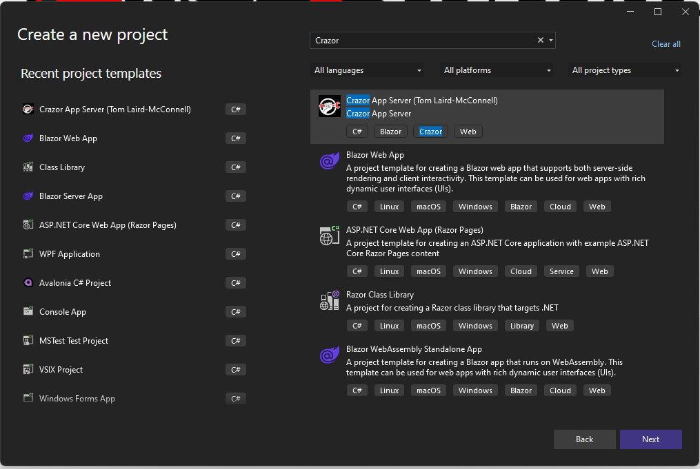
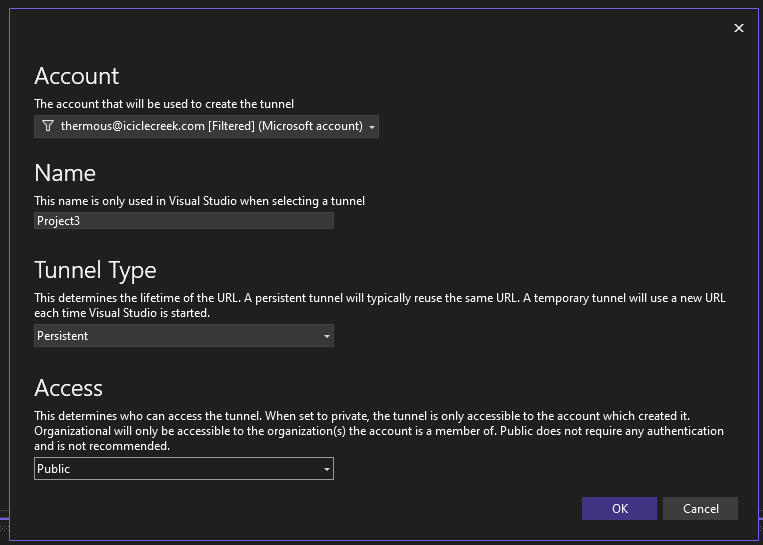
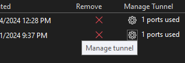
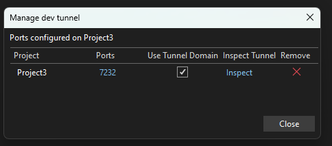
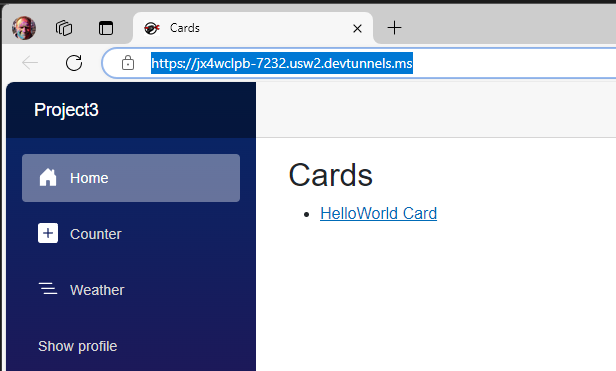
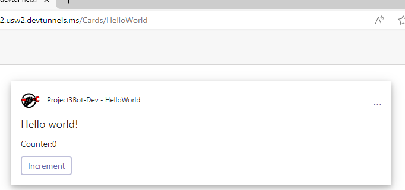

# QuickStart

This will walk you through creating a Crazor App Project using Blazor.

# Prerequisites 

[Install Prerequisite tools](../InstallTools.md)

# Creating a new project

## Option 1: Creating from Visual Studio

Create a **Crazor App Server** project



## Option 2: Creating from CLI

NOTE: you can alternatively create the project from the cli by using
```cmd
dotnet new crazorserver
```

# Add a dev tunnel for local development

For bots to work with Teams and other apps they need a public addressable endpoint. Dev tunnels does exactly that, so we will create a dev tunnel with the following options:

* **TunnelType=Persistant** 
* **Access=Public** 



Run the project. You will be launched a on page like https://jx4wclpb-7232.usw2.devtunnels.ms/. You will have an error, but that's OK. We just want to get the url for your project. Copy that and save it off someplace.

## Configure tunnel

Click on your devtunnel settings  to manage the tunnel:



Make sure that **Use Tunnnel Domain** is turned on:



> **(ALTERNATIVE) Create a public tunnel using ngrok.io** 
>
> ```ngrok http --host-header=preserve https://localhost:7232```
>
> The URL it creates will look something like this: ```https://1a52-50-35-77-214.ngrok-free.app```

# Register your bot 

In the same folder as your csproj, run **RegisterBot** tool to create a development bot called **MyBot-Dev**. 

```cmd
registerbot --name MyBot-Dev --endpoint https://jx4wclpb-7232.usw2.devtunnels.ms/
```

> NOTE: By convention we use **MyBot-Dev** because when we publish to production we want to register **MyBot** as the production bot

# Run project

You should see this:



And if you click on the card you should see this:



# Next Steps

* [Create your own Hello World app](HelloWorldWalkthrough.md)
* [Create an app with actions](CountersWalkthrough.md)

# More information

* [Card Views](CardView.md) - How to define views with **CardView** with **Blazor**
* [Card Apps](../CardApp.md) - How to create a **CardApp** class to define state and operations against state.
  * [Card App Memory](../Memory.md) - Information on persistence and memory model
* [Card Routing](../RoutingCards.md) - Information on customizing urls to support deep linking into cards
* [Authentication](../Authentication.md) - Authenticating users and Authorizing access to create per-user secure views
* [Writing Unit tests](../UnitTests.md) - Writing unit tests for your cards.
* [Components (Advanced)](Components.md) - How to define reusable components via Blazor Components


  

