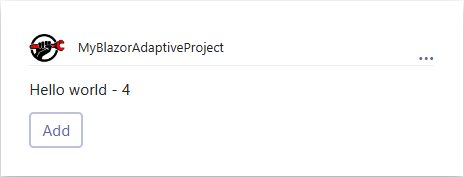
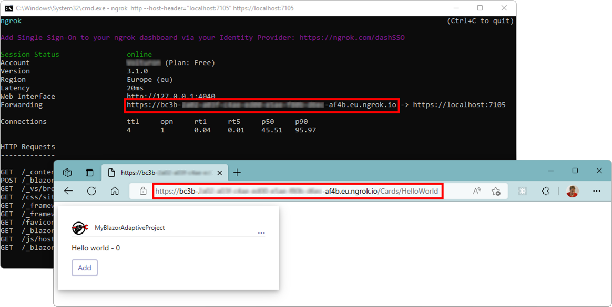
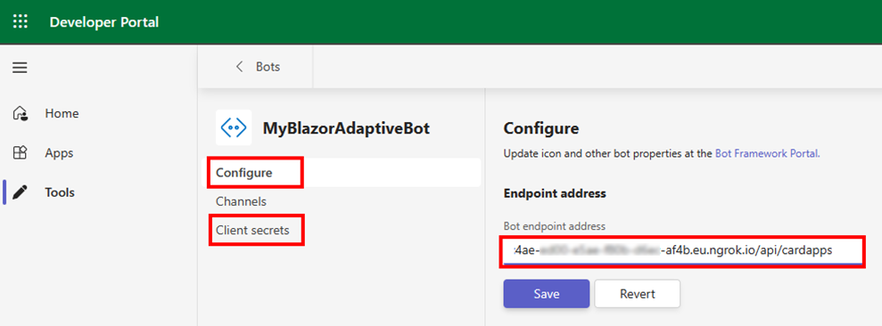
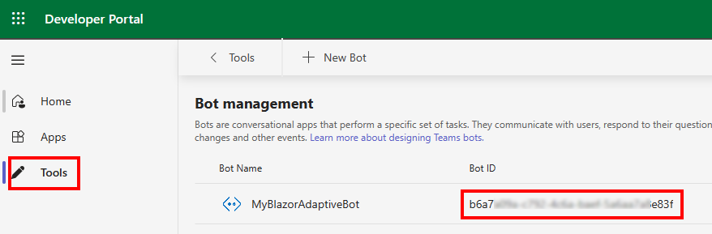
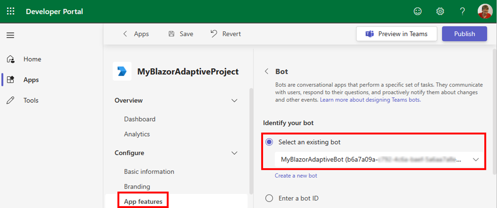
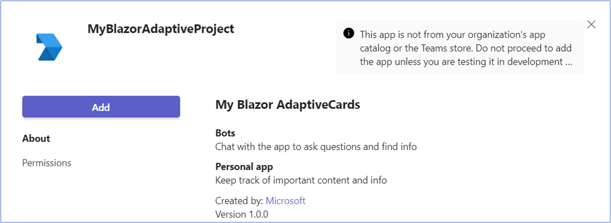
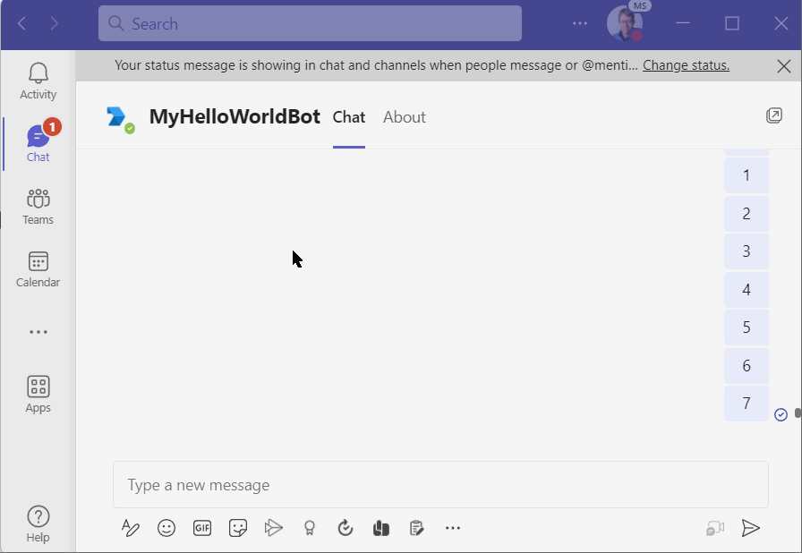



# Create a Bot in Teams with Blazor Adaptive Cards

In this article, we will create a Microsoft Teams Bot developed in C#,
using a Blazor Server project with Crazor.Blazor library to generate Adaptive Cards.

## Prerequisites

  1. Install the latest version of Visual Studio 2022 with the **ASP.NET and web development workload**.
  2. Go to https://fuselabs.visualstudio.com to create a new *Personal Access Token* (PAT) with **Packaging Read** access rights.
  3. Add a new **NuGet Package Source**, called *FuseLabs*, using this PAT:
     ```
	 dotnet nuget add source "https://fuselabs.pkgs.visualstudio.com/c861868a-1061-43d1-8232-ed9ab373867c/_packaging/Crazor/nuget/v3/index.json" 
                  --name FuseLabs
                  --username <YOUT_EMAIL_ADDESS>
                  --password <GENERATED_PAT>
     ```

## 1. Creating Adaptive Cards in a Blazor Server project

  1. Open **Visual Studio** and create a **new project** named *"MyBlazorAdaptiveProject"*.
  2. Choose the **Blazor Server App Empty** template and keep the Configure for HTTPS option checked.
  3. Add these **NuGet packages**, using the *FuseLabs* source and with the **Include prerelease** checked:
     - Microsoft.Bot.Builder.Azure.Blobs
     - Crazor.Server
     - Crazor.Blazor

     

  4. Open the **Program.cs** file and add this code before `builder.build()` command.
     ```csharp
	 // To activate api/cardapps
	 builder.Services.AddControllers();
	 
	 // Register blob storage for state management
	 var storageKey = builder.Configuration.GetValue<string>("AzureStorage");
	 if (!string.IsNullOrEmpty(storageKey))
	 {
	 	builder.Services.AddSingleton<IStorage, BlobsStorage>(sp => 
	 		new BlobsStorage(storageKey, nameof(MyBlazorAdaptiveProject).ToLower()));
	 }
	 
	 // Inject Crazor services
	 builder.Services.AddCrazor(nameof(MyBlazorAdaptiveProject));
	 builder.Services.AddCrazorServer();
	 builder.Services.AddCrazorBlazor();
	 ```

	 And this code before `app.Run()`.
     ```csharp
     app.UseCrazorServer();
     app.MapControllers();
     ```

  5. Open the file **_imports.razor** and add these two usings.
     ```csharp
     @using Crazor.Blazor
     @using Crazor.Blazor.Components.Adaptive
     ```

  6. Add these lines in the **_host.cshtml** file:
     ```html
     <script src="https://unpkg.com/adaptivecards@latest/dist/adaptivecards.min.js"></script>
     <script src="https://unpkg.com/markdown-it/dist/markdown-it.js"></script>
     <script type="text/javascript" src="/js/hostconfig.js"></script>
     <style>
         .cardDiv {
             width: 400px;
             padding: 10px;
             box-shadow: 0 4px 8px 0 rgba(0, 0, 0, 0.2), 0 6px 20px 0 rgba(0, 0, 0, 0.19);
             text-align: center;
         }
     </style>
     <link rel="stylesheet" type="text/css" 
           href="https://adaptivecards.io/node_modules/adaptivecards-designer/dist/containers/teams-container-light.css">
	  ```

     Add this **hostconfig.js** file into the folder **wwwroot/js**, with this content.
     ```js
	  const adaptiveHostConfig = new AdaptiveCards.HostConfig({ XXX });
	  ```
	 
	 Where the `{ XXX }` is a JSON object. A sample is downloadable on the [GitHub site](https://github.com/Microsoft/AdaptiveCards/blob/master/samples/HostConfig/sample.json).

	 > ⚠️ During development phases, copy the **wwwroot/images** files (about.png, refresh.png, ...)
	 
  7. Open the **appsettings.json** file and add these configurations.
     ```json
     "BotName": "MyBlazorAdaptiveProject",
     "HostUri": "https://localhost:7105",
     "MicrosoftAppType": "MultiTenant",
     "MicrosoftAppId": "",
     "MicrosoftAppPassword": "",
     "TeamsAppId": ""
	 ```

  8. Add a new page **Cards.razor**, in the folder Pages, with this content:

     ```xml
     @page "/Cards/{*RouteFragment}"
     <Crazor.Blazor.Pages.Cards routeFragment="@RouteFragment" />

     @code
     {
        [Parameter]
        public string? RouteFragment { get; set; }
     }
     ```

  9. Add a sample file **Default.razor** in a folder named **Cards/HelloWorld**.

     ```xml
     @inherits CardView
     
     <Card Version="1.5">
         <TextBlock>Hello world - @Counter</TextBlock>
         <ActionSet>
             <ActionExecute Title="Add" Verb="@nameof(OnIncrement)" />
         </ActionSet>
     </Card>
     
     @code {
         public int Counter { get; set; } = 0;
     
         public void OnIncrement() => this.Counter++;
     }
	 ```

  10. Run your project and display this card: `https://localhost:7105/Cards/HelloWorld`.
     
	 

## 2. Display this card in Microsoft Teams

In this section, we will use the tool **ngrok** to give a public internet access to your **local application**.

  1. Go to https://ngrok.com and download the zip file and extract it into a local path.
  
  2. Go to the **setup page** to copy the command with your personal authentication **token** and run this command in a new Command Prompt.
     ```
     ngrok config add-authtoken <YOUR_PERSONAL_TOKEN>
	 ```

  3. Open a Command Prompt and run this **ngrok command**.
     ```
	 ngrok http --host-header="localhost:7105" https://localhost:7105
	 ```

  4. You can now display the AdaptiveCard using the public ngrok.io URL 
     

Next, create a Microsoft Teams manifest to define all parameters of your application: URL, icons, features, ...

## 2.1. Configure a Bot

  1. Go to https://dev.teams.microsoft.com to create the **Bot Manifest** for Microsoft Teams.
  
  2. In the **Tools** section, select the **Bot Management** and create a **new Bot**. Call it *"MyBlazorAdaptiveBot"*.
  
  3. Set the **Endpoint Address** using the previous ngrok.io URL followed by **"/api/cardapps"** and click on **Save**.
     
 
  4. Click on **Client Secrets** panel and create a new secret for your Bot. 
     Copy this value into the **AppSettings.json / MicrosoftAppPassword** parameter.

  5. Come back to **Tools** section to copy the Bot ID and write this value into 
     the **AppSettings.json / MicrosoftAppId**.
     

## 2.2. Configure the Teams Application

  6. In the section **Apps**, click on the **New app** button and set a name for your manifest (MyBlazorAdaptiveProject).
  
  7. Copy the **App ID** value to set the **AppSettings.json / TeamsAppId**.
  
  8. Write **required** fields:
	   - **Short description** like `My Blazor AdaptiveCards`.
	   - **Developer** like `Microsoft`.
	   - **Developer website** URL like `https://mysite.com`.
	   - **Privacy policy** URL like `https://mysite.com/privacy`.
	   - **Terms of use** URL like `https://mysite.com/termofuse`.
	  
  9. Click the **Save** button.
  
  10. Go to the **Configure / App features** panel and, in the **module Bot**, select the bot created previously.
      
  
  11. On the same screen **select the scopes** in which people can use this command: **Personal**.

  12. Click on **Save** button. 

  13. Click on **Preview in Teams** button (top/right) to open Teams and add this bot.
      

  14. And to check if the bot works using this command. 
      This command `post` is only available with Crazor to display a specific card.
      ```
	  post HelloWorld
	  ```

      