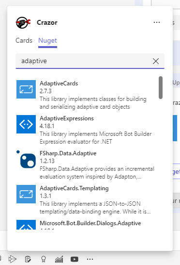

# Conceptual Model

The web services hosts multiple **Card applications**.  Each card application represents a micro-app experience that can be used independently and is made up of a views that are defined using Adaptive Cards.

## Card Applications

Your service can host 1:N **Card Applications**.  A card application is a mini application which is based on AdaptiveCards, using Razor as the templating engine. 

## Card Views

Each card application is made up of 1:N **Card Views**. A card view is a razor template, binding the data and logic to create a "screen" in the application. 

# The CardApp Class

The **CardApp** serves a couple of roles in the system.

* It manages the shared state for all templates in the folder
* It can receive dependency injected resources (the razor templates don't have direct access to dependency injection)

Any properties and methods you put onto the app class are accessible from all **CardView** objects in the folder via the **App** property.

You do not have to define a card application, but to do so you simply create a class which derives from **CardApp**.

 **CardApp** names have a naming convention with the name of the **folder**. The name of the **folder name** is what shows up in the urls, and the name of the class is the name of the folder + App like this: **"{*name of the folder*}App"**

```Cards/Foobar/FoobarApp.cs```

## Properties

Properties on the **CardApp** are available to all **CardView** in the application via the **App** property.

To load and persist the values of any property you have 2 mechanisms:

* Use **[Memory]** attributes on properties. *See [Memory](Memory) for more details*
* You can override the **LoadAppAsync()** and **SaveAppAsync()** methods to lookup/save your data.

## Methods

You can define any methods you like on the **CardApp**.

A useful pattern is to put methods which manipulate your shared state on the app so that you can consolidate data manipulation methods for all **CardView** classes. For example, you can add CRUD methods which manipulate your data to the **CardApp**, and call **App.Create(...)** from a view to manipulate your data directly.

## Dependency Injection

The **CardApp** is created via dependency injection and so it can get access to any resources that it needs and expose them as properties to the **CardView** templates.

## Example CardApp

```C#
public class ExampleApp : CardApp
{
    public ExampleApp(IServiceProvider services, IConfiguration configuration) : base(services)
    {
        this.Configuration = configuration;
    }
    
    public IConfiguration Configuration {get;set;}

    [SharedMemory]
    public Entity Entity { get; set;}
    
    public async Task LookUpEntity(String id)
    {
        ... 
    }
}
```

## Search extensions

To implement a search extension like this:



you simply need to:

* override CardApp.**OnSearchQueryAsync**() to return search results

* Update manifest to have a **query** command pointing to your app route.

```c#
public async override Task<SearchResult[]> OnSearchQueryAsync(MessagingExtensionQuery query, CancellationToken cancellationToken)
{
    var results = await ...lookup your data...
    return results.Select(result => new SearchResult()
                           {
                               Title = ...,
                               Subtitle = ...,
                               Text = ...,
                               ImageUrl = ...
                               Route = $"/Cards/{...route for your search result...}"
                           }).ToArray();
}
```

And in your manifest commands section:

```json
        {
          "id": "/Cards/{...your app name...}",
          "type": "query",
          "title": "...",
          "description": "...",
          "initialRun": false,
          "parameters": [
            {
              "name": "search",
              "description": "Enter in search terms",
              "title": "Search"
            }
          ]
        }
```

The **route** returned in the search result will be used when someone clicks on an entry, unfurling the url into the card and inserting it.


