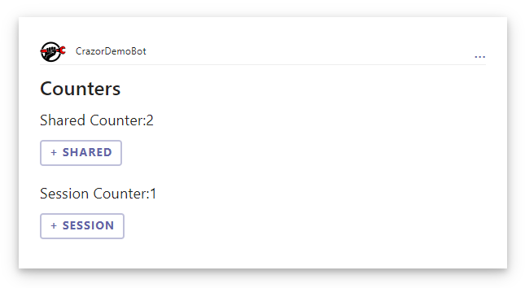

# Data Binding walkthrough

We are going to create a data binding sample application which increments and decrements counters. It will show

* [SharedMemory] and [SessionMemory] attributes
* Hooking up code for verbs

## 1. Create a folder for your app

The **Cards** folder is a special folder that creates an area for your applications to live (just like Pages organizes your web pages). 

The convention is that each app is a sub-folder in the Cards folder, so we create a folder **/Cards/Counters**

## 2. Create a CountersApp.cs file

Create  **/Cards/Counters/CountersApp.cs** and define **CountersApp**

```C#
    public class CountersApp : CardApp
    {
        public CountersApp(IServiceProvider services)
            : base(services)
        {
        }

        [SharedMemory]
        public int SharedCounter { get; set; } = 0;
    }
```

We have defined a SharedCounter and placed a **[SharedMemory]** attribute on it.  The value for this property will automatically be saved and restored for us with a scope that means all users will see the same value...aka it's shared

## 3. Create a Default.cshtml file

By default the CountersApp will load the **Default.cshtml** file as the initial view for the application. 

Create **/Cards/Counters/Default.cshtml**

```xml
@using CrazorDemoBot.Cards.Counters
@inherits CardView<CountersApp>

<Card Version="1.5">
    <TextBlock Size="ExtraLarge" Weight="Bolder">Counters</TextBlock>
    <TextBlock Size="Large">Shared Counter:@App.SharedCounter</TextBlock>

    <ActionSet>
        <Action.Execute Title="+ Shared" Verb="OnIncrementShared" />
    </ActionSet>

    <TextBlock Size="Large">Session Counter:@SessionCounter</TextBlock>
    <ActionSet>
        <Action.Execute Title="+ Session" Verb="OnIncrementSession" />
    </ActionSet>

</Card>

@functions {
    [SessionMemory]
    public int SessionCounter { get; set; }

    public void OnIncrementSession() => this.SessionCounter++;

    public void OnIncrementShared() => App.SharedCounter++;
}
```

Things to notice:

* We have defined **SessionCounter** as a property of this view
* We have put a **[SessionMemory]** attribute on it, to say that the value should be persisted with a scope that it is unique for each session.
* We have methods hooked up to the verbs that simply change the properties.  The method name is the same as the verb name.


That's it.  Now run the application and go to http://localhost:{yourport}/Cards/Counters 

You should see something like this:



As you click on it, the card is refreshing itself and updating the values.  If you copy and paste the link to another browser window you will see that the shared values are shaerd and the session values are per window.