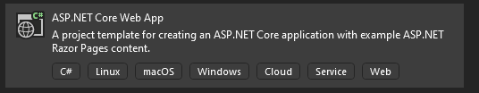

# Adding Crazor 

Adding crazor is super easy.  Take a stock Asp.Net Core MVC project and add the Crazor package.



## Add Crazor package

>  NOTE: Currently Crazor is only published to an internal Microsoft devops nuget feed.  To connect to this feed, add a **nuget.config** in the root of your project with the following:

```xml
<?xml version="1.0" encoding="utf-8"?>
<configuration>
  <packageSources>
    <clear />
    <add key="Crazor" value="https://fuselabs.pkgs.visualstudio.com/c861868a-1061-43d1-8232-ed9ab373867c/_packaging/Crazor/nuget/v3/index.json" />
  </packageSources>
</configuration>
```

Then you can add the **crazor** package

```shell
nuget add package crazor
```

And register crazor in your **program.cs** :

```c#
builder.Services.AddCrazor();
```

## Adding IStorage provider

The default IStorage provider is the volitile MemoryStorage where all data is simple stored in memory and lost when you restart the process. 

To deploy a service you need a real IStorage provider. Here's how to add the Azure Blob IStorage implementation:

```shell
nuget add Microsoft.Bot.Builder.Azure.Blobs
```

Adding to your **program.cs**:

```C#
var storageKey = builder.Configuration.GetValue<string>("AzureStorage");
if (storageKey != null)
	builder.Services.AddSingleton<IStorage, BlobsStorage>(sp => new BlobsStorage(storageKey, "mybot"));
```

# Modifications to your Web Project

1. add a **Cards** folder (should be a peer to **Pages** folder)

2. Create a **Cards/_ViewImports.cshtml** file containing this:

   ```C#
   @using AdaptiveCards
   @using Crazor
   @using Crazor.Exceptions
   @using Crazor.Attributes
   @using System.ComponentModel.DataAnnotations
   @removeTagHelper *, Microsoft.AspNetCore.Mvc.TagHelpers
   @removeTagHelper *, Microsoft.AspNetCore.Mvc.Razor
   @addTagHelper *, Crazor
   ```


# Local development 

* set **BotName**: "{friendly name for your service}",

* set **HostUri** in your project appsettings.json to the appropriate https://localhost:{PORT}

* *(Optional)* if you have a multi-tenant bot registration add **MicrosoftAppId** to **appsettings.json**

* *(Optional)* if you have a multi-tenant bot registration store the **MicrosoftAppPassword** in you **user-secrets**

* *(Optional)* If you have azure storage store **AzureStorage** setting in your **user-secrets** 

  

# (Optional) Update your index.html to enumerate your cards

Insert into the content of your **Index.html**

```html
@using Crazor
@using System.Reflection
@using Neleus.DependencyInjection.Extensions
@inject IServiceByNameFactory<CardApp> serviceByName
<h2>Cards</h2>
<ul>
    @foreach (var cardAppType in serviceByName.GetNames().OrderBy(n => n))
    {
        var appName = cardAppType.Replace("App", String.Empty);
        <li><a href="/Cards/@appName">@appName Card</a></li>
    }
</ul>
```

This will give you an easy way to interacting with your cards:


