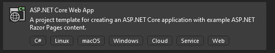
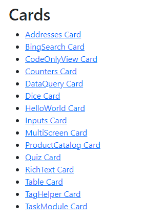

# Adding Crazor 

Adding crazor is super easy.  Take a stock Asp.Net Core MVC project and add the Crazor package.



## Add Crazor package

>  **NOTE: Currently Crazor is only published to an internal Microsoft devops nuget feed.  To connect to this feed, add a nuget.config in the root of your project with the following:**

```xml
<?xml version="1.0" encoding="utf-8"?>
<configuration>
  <packageSources>
    <clear />
    <add key="Crazor" value="https://fuselabs.pkgs.visualstudio.com/c861868a-1061-43d1-8232-ed9ab373867c/_packaging/Crazor/nuget/v3/index.json" />
  </packageSources>
</configuration>
```

Then you can add the **crazor** packages

```shell
nuget add package Crazor
nuget add package Crazor.Mvc
nuget add package Crazor.Server
```

And register crazor in your **program.cs** :

```c#
builder.Services.AddCrazor();
builder.Services.AddCrazorMVc();
builder.Services.AddCrazorServer();
...
app.UseCrazorServer();
```


## Adding IStorage provider

The default IStorage provider is the volitile MemoryStorage where all data is simple stored in memory and lost when you restart the process. 

To deploy a service you need a real IStorage provider. Here's how to add the Azure Blob IStorage implementation:

```shell
nuget add Microsoft.Bot.Builder.Azure.Blobs
```

Adding to your **program.cs**:

```C#
var storageKey = builder.Configuration.GetValue<string>("AzureStorage");
if (storageKey != null)
	builder.Services.AddSingleton<IStorage, BlobsStorage>(sp => new BlobsStorage(storageKey, "mybot"));
```

## Add Bot Controller to Server

Crazor requires that a bot controller for integrating with Teams/Office, etc. To do that in a blazor project you need to make sure that following is there:

```C#
builder.Services.AddControllers();
var mvcBuilder = builder.Services.AddMvc();
if (Debugger.IsAttached)
    mvcBuilder.AddRazorRuntimeCompilation();
...
app.UseStaticFiles();
app.MapRazorPages();
app.MapControllers();
```

# Modifications to your Web Project

1. add a **Cards** folder (should be a peer to **Pages** folder)

2. Create a **Cards/_ViewImports.cshtml** file containing default namespaces and tag helpers with this content:

   ```C#
   @using AdaptiveCards
   @using Crazor
   @using Crazor.Attributes
   @using System.ComponentModel;
   @using System.ComponentModel.DataAnnotations
   @removeTagHelper *, Microsoft.AspNetCore.Mvc.TagHelpers
   @removeTagHelper *, Microsoft.AspNetCore.Mvc.Razor
   @addTagHelper *, Crazor.Mvc
   @addTagHelper *, ...YOURASSEMBLYNAME...
   ```

# appsettings.json

Crazor has some settings it needs to service your cards:

``` json
{
  ...,
  "AllowedHosts": "*",
  "BotName": "...yourBotName...",
  "HostUri": "https://localhost:7131",
  "MicrosoftAppType": "MultiTenant",
  "MicrosoftAppId": "...bot appId...",
  "TeamsAppId": "...teams appId...",
}
```

| Key                  | Optional | Description                                                  | Default              |
| -------------------- | -------- | ------------------------------------------------------------ | -------------------- |
| **BotName**          |          | The name of your bot registration (aka FooBot)               |                      |
| **HostUri**          |          | The root uri for your web site (Exampl: https://localhost:5171) |                      |
| **MicrosoftAppType** |          | MultiTenant                                                  |                      |
| **MicrosoftAppId**   |          | The bot appId                                                |                      |
| **TeamsAppId**       |          | The teams appId used in manifest                             |                      |
| **BotIcon**          | optional | Icon to use for the bot                                      | /images/boticon.png  |
| **AboutIcon**        | optional | Icon to use for About links                                  | /images/about.png    |
| **SettingsIcon**     | optional | Icon to use for Settings Links                               | /images/settings.png |
| **OpenLinkIcon**     | optional | Icon to use for Open links                                   | /images/openlink.png |
| **RefreshIcon**      | optional | Icon to use for Refresh links                                | /images/refresh.png  |


# User Secrets

Add to your user secrets.json for your project.

```json
{
  "MicrosoftAppPassword": "...",
  "AzureStorage": "DefaultEndpointsProtocol=..."
}
```

| Key                      | Description                                                  |
| ------------------------ | ------------------------------------------------------------ |
| **MicrosoftAppPassword** | If you have multi-tenant bot registration store your password here |
| **AzureStorage**         | If you are using AzureStorage store the key here.            |

  

# (Optional) Update your index.html to enumerate your cards

Insert into the content of your **Index.html**

```html
@using Crazor
@using System.Reflection
@using Neleus.DependencyInjection.Extensions
@inject CardAppFactory cardAppFactory
<h2>Cards</h2>
<ul>
    @foreach (var cardAppType in cardAppFactory.GetNames())
    {
        var appName = cardAppType.Replace("App", String.Empty);
        <li><a href="/Cards/@appName">@appName Card</a></li>
    }
</ul>
```

This will give you an easy way to interacting with your cards:


