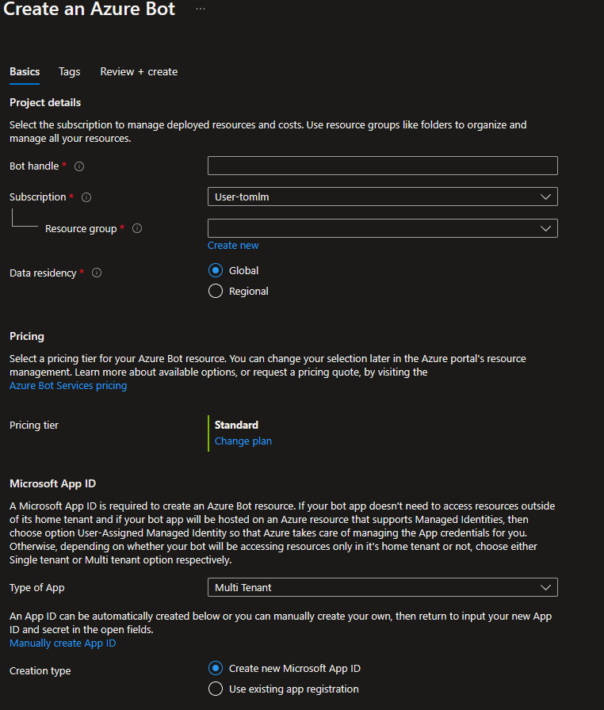
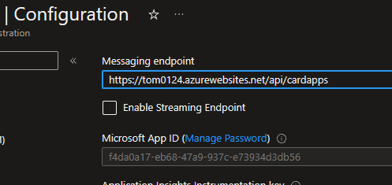

# Bot Registration

A **Bot** is nothing more than **contact record** which maps a **contact name** to deployed **web service endpoint**.

Each deployed service needs a bot registration so that users can interact with it.

There are 2 ways to create this registration, using the **RegisterBot** **CLI** tool or **manually** via the **Azure Portal**

## (Option 1) Create a Bot Registration from CLI 

This is the recommended way to create the bot registration. 

### Prerequisites

* Install AZ CLI [How to install the Azure CLI | Microsoft Learn](https://learn.microsoft.com/en-us/cli/azure/install-azure-cli)
* Install the **RegisterBot** CLI tool by running
  ```dotnet tool install -g RegisterBot```

### Usage

```shell
RegisterBot --resource-group [groupName] --name [botName] -endpoint [endpoint]

Creates a bot registration for [botName] pointing to [endpoint] with teams channel enabled.
```

There are 2 ways to run use **RegisterBot**:

* **interactive** If you pass in no parameters it will prompt you for the bot name, resource-group and endpoint.
* **arguments** you can pass in arguments to script the creation process

It will create all necessary resources as needed and update the settings for the web site all from one command.

> NOTE: You can use the **RegisterBot** cli  to change the endpoint for an existing bot. It is smart and will not create new resources unless they are missing.


## (Option 2) Create a Bot Registration via Azure Portal

If you don't want to use the CLI or are just a glutton for punishment you can manually create a bot registration via the **Azure Portal**.

To do that to the azure portal [Create an Azure Bot](https://ms.portal.azure.com/#create/Microsoft.AzureBot) template:



Create a **MultiTenant** ***registration only bot***

### Get the MicrosoftAppId/MicrosoftAppPassword

Go to the bot Configuration tab 

1. Change the endpoint to be your web service **https://{SERVICEHOSTNAME}/api/cardapps**
2. copy and save off the **"MicrosoftAppId"** 

1. Click on **Manage Password**

2. Go to **Certificates & Secrets** tab and Click on **Create Client Secret** This is the **MicrosoftAppPassword** which you should copy and save off


> NOTE: the endpoint should end with **/api/cardapps** NOT **/api/messages**


### Update Azure Web Service configuration

Update the web service configuration with the following settings.

| key                      | description                                                  | example                              |
| ------------------------ | ------------------------------------------------------------ | ------------------------------------ |
| **MicrosoftAppType**     | The apptype for your bot registration                        | MultiTenant                          |
| **MicrosoftAppId**       | The AppID for your bot                                       | xxxxxxxx-xxxx-xxxx-xxxx-xxxxxxxxxxxx |
| **MicrosoftAppPassword** | The super secret password you kept from the bot registration | ...PASSWORD...                       |
| **HostUri**              | The root url for your web site (Crazor needs this to know what urls to support link unfurling) | https://mywebsite.azurewebsites.net  |
| **BotName**              | A user friendly name for your bot (Crazor needs this to create appropriate title for cards) | My Cool Bot                          |
| **AzureStorage**         | The connection string for your azure storage account         | ... ya know what it looks like...    |


