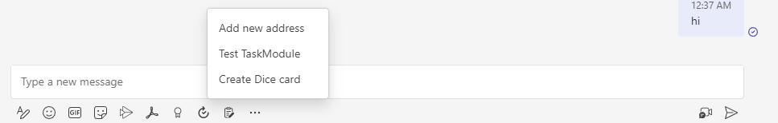
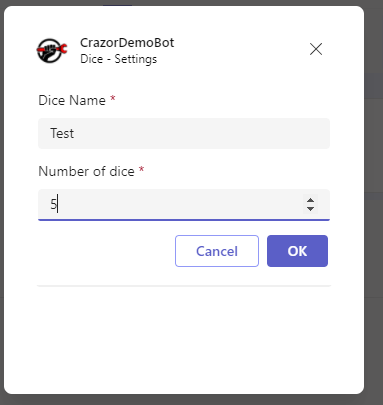
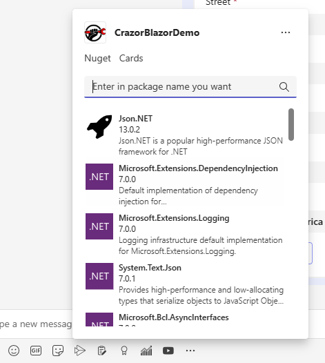
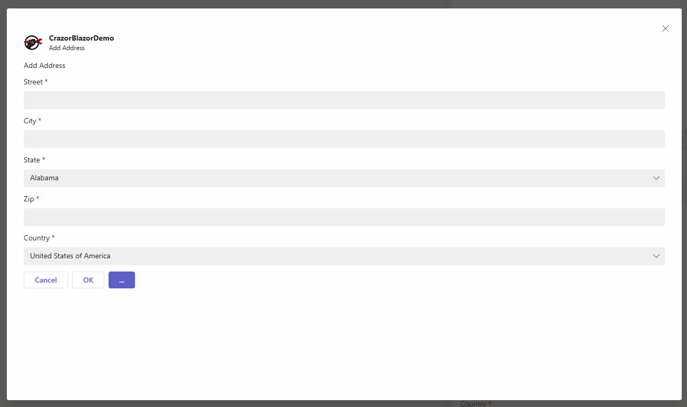
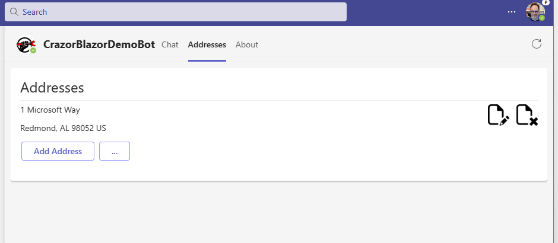
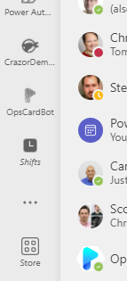
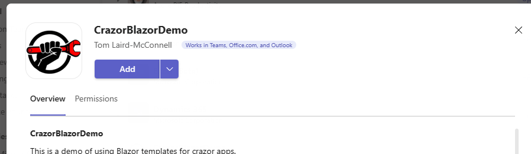

# Teams Integration

Teams integration is accomplished through a complex manifest.json file.  With crazor, you don't have to learn a complex json format and deal with the complexities of changing it for different deployements.  With Crazor, the manifest is **auto-generated** for you using all of the information from settings, reflection and attributes to build the manifest.

# Manifest metadata

In program.cs, when you call **AddCrazorServer()** you are given the opportunity to make modifications to the auto-generated manifest. This is the point to supply general metadata like the name of your bot, the developer and description information.

```c#
builder.Services.AddCrazorServer((options) =>
{
    options.Manifest.Version = "1.0";
    options.Manifest.Name.Short = "MyBot";
    options.Manifest.Name.Full = "MyBot is cool.";
    options.Manifest.Developer.Name = "Contoso";
    options.Manifest.Description.Short = "MyBot Cards";
    options.Manifest.Description.Full = "This is a demo of using Blazor templates for crazor apps.";
});
```
## Icons
There are 2 required icons for a manifest. By default the auto generated manifest will use settings/conventions to find the icon
| Setting | Default               |
| ------------- | --------------------- |
| **"BotIcon"**       | "/images/boticon.png" | 
| **"OutlineIcon"** |   "/images/outline.png" |


## To add a Teams Command

To register a card as a Action Command you add a **CommandInfo** attribute to a CardView.



You add a **[CommandInfo()]** attribute into your template like this:

```asp
@attribute [CommandInfo(title: "Add Address", description: "Add a new address")]

<Card Version="1.5">
...
</Card>
```

When the action is invoked the card will be shown in a TaskModule window like this:



| Property        | Description                                                 | Default            | Example              |
| --------------- | ----------------------------------------------------------- | ------------------ | -------------------- |
| **Title**       | The name of the command in the menu                         |                    | *Add*                |
| **Description** | The description of the command in the menu                  |                    | *Add a address*      |
| **Context**     | Comma delimited list of where the command should be exposed | "message, compose" | *"message, compose"* |
| **Type**        | The type of command ["action","query"]                      | "action"           | "action"             |

## To Add a Teams Query command

To register a card as a Query Command you add a **CommandInfo** attribute to a CardView with **Type = CommandType.Query**. Then you add one more **[QueryParameter]** attributes to define the inputs to the query.

```asp
@attribute [CommandInfo(title: "Nuget", description: "Search for nuget packages", Type = CommandType.Query)]
@attribute [QueryParameter(name: "search", description:  "Enter in package name you want", title: "Package")]

<Card Version="1.5">
...
</Card>
```

And it will create UX like this:



The **QueryParameter** attribute has the following definition:

| Property        | Description                                                  | Default | Example                 |
| --------------- | ------------------------------------------------------------ | ------- | ----------------------- |
| **Name**        | The name of the input that you will process in  your binding |         | "packageName"           |
| **Title**       | The title of the tab                                         |         | "Nuget"                 |
| **Description** | The description of the input field                           |         | "Enter in package name" |
| **InputType**   | One of [Text\|TextArea\|Number\|Date\|Time\|Toggle]          | "Text"  | "Text"                  |
| **Value**       | The default value for the command. This is what is submited as the value for Name if no input is received from the user. |         |                         |

You can add multiple attributes to define multiple input fields. 

## To control the look and feel of TaskModule window

To control the look and feel of the task module window you add the **[TaskInfo]** attribute to the card view like this:

```asp
@attribute [TaskInfo(title: "Add Address", width: "medium", height: "medium")]

<Card Version="1.5">
...
</Card>
```




| Property   | Description                                                  | Default      | Example       |
| ---------- | ------------------------------------------------------------ | ------------ | ------------- |
| **Title**  | The title of the task module dialog                          | Name of card | "Add Address" |
| **Width**  | The desired width of the dialog either ["small" \| "medium" \| "large"] or px | "medium"     | "600px"       |
| **Height** | The desired height of the dialog either ["small" \| "medium" \| "large"] or px | "medium"     | "600px"       |

## To pin a card as a Static Tab

To pin a card to as a static Tab you add the **TabInfo** attribute to your Card View template.

```asp
@attribute [TabInfo("Addresses")]

<Card Version="1.5" >
...
</Card>
```



| Property  | Description      | Default      | Example     |
| --------- | ---------------- | ------------ | ----------- |
| **Title** | The title of tab | Name of card | "Addresses" |


# Side-loading your teams manifest

When you web service is deployed the teams manifest is available from the web service itself.  The manifest will reflect all of the correct information to connect to the web service you get the manifest from.

For example, if your web service is https://contoso.com, the teams manifest will  be **https://contoso.com/teams.zip** 

To side load in teams

1. go to **Store** in teams
2. Click on **Manage your Apps**
3. Click on **Upload an App**
4. Paste in your manifest link (Ex: https://contoso.com/teams.zip)
5. If it is correct you will see a screen like this.  Click the **ADD** button to add the integration to teams.

You should now be able to do link unfurling and commands for your crazor based project.


