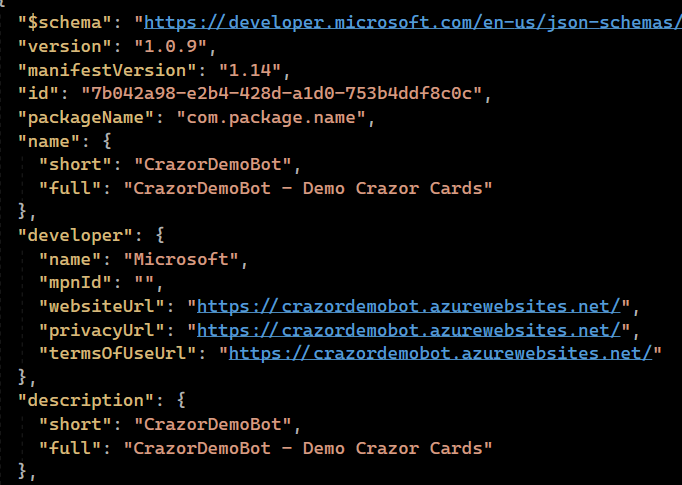
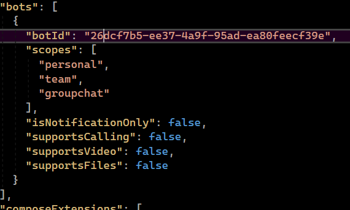
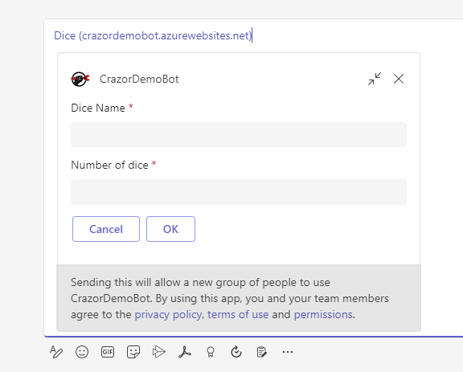
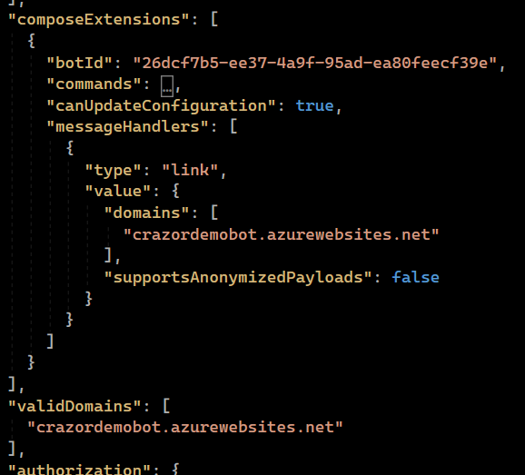
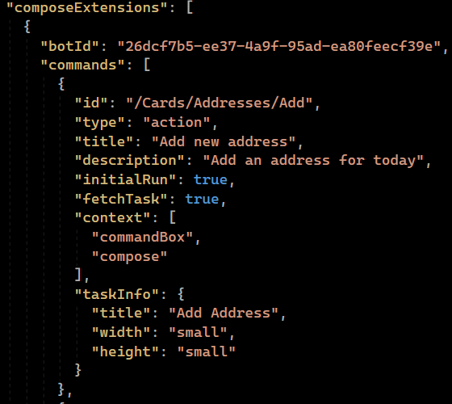
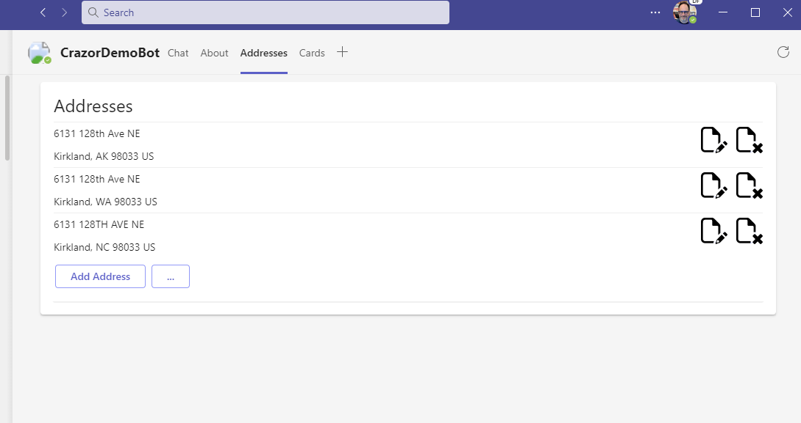
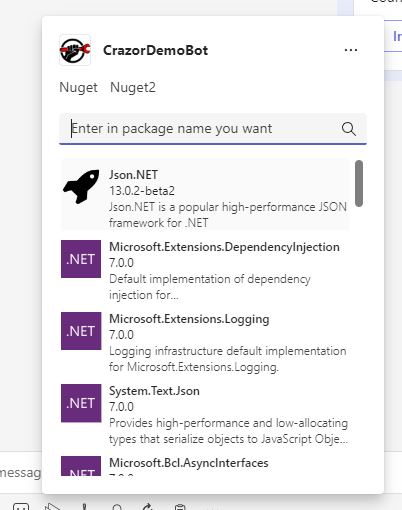

# Teams stuff

In the **Teams** folder there are 3 files

* **color.png** - the colorful icon that teams will display for your bot on cards
* **outline.png** - 1 transparency that will be used to pin your icon to the side channel
* **manifest.json** - the metadata about your bot that teams wants

# manifest.json 

The manifest describes all of the data teams needs to interact with your crazor based bot.

## Edit extension metadata

The extension metadata describes your bot and information about you as a developer



1. **Set the $.id to your bot Id **
2. **update name, developer info**

## **Add your bot**

This enables your bot to receive and response to messages. 



1. update botId with your **BotId** = ***your MicrosoftAppId***

## To add link unfurling for your cards

This enables your bot to unfurl your web site links into cards.



1. update **BotId** =  ***your MicrosoftAppId***
2. update the **composeExtensions[].messageHandlers.domains** => domain for your web site to link unfurl
3. add your web site domain to **validDomains**


## To add a card as a Task Module


To add your card as a Task Module you edit the **composeExtensions** section to add **commands**



For each card you want to surface as custom command task module:

1. Set **Id = ** ***path to your card*** (Example: "**/Cards/Addresses**")
2. Set **context** to define where the card shows up
   1. **compose** (for inserting card into edit box)
   2. **commandBox** (for starting card from command box)
   3. **message** (for starting card from context of a message)
3. Update the title, taskinfo etc. appropriately.

## To add a card as a Tab Module

You can add your card as a tab by editing the **staticTabs** section.

```json
 "staticTabs": [
	...
     {
      "entityId": "/Cards/Addresses",
      "name": "Addresses",
      "contentBotId": "26dcf7b5-ee37-4a9f-95ad-ea80feecf39e",
      "scopes": [ "personal" ]
    }
   ...
```

For each card you want to have be a tab add a section to **staticTabs** collection:

1. set **name** to the name of the tab
2. set **entityId** => ***path to your card*** (Example: "**/Cards/Addresses**")
3. set **contentBotId** => Your **MicrosoftAppId**

## To Add a CardView as a messaging query extension



Edit team manifest to register a command **type="query"** with CommandId => route to your card.

```json
{
    "id": "/Cards/Nuget/Details",
    "type": "query",
    "description": "Search Nuget for packages",
    "title": "Nuget",
    "initialRun": true,
    "parameters": [
        {
            "name": "search",
            "description": "Enter in package name you want",
            "title": "Package"
        }
    ]
},
```

In your cardview implement **OnSearch()** method to return search results.


## 

# Side-loading your teams manifest

Zip **all 3 files** up into a .zip file and **import** into **teams** 

1. go to **Store** in teams
2. Click on **Manage your Apps**
3. Click on Upload an App
4. When it comes up, click on **ADD TO TEAMS**

You should now be able to do link unfurling and commands for your crazor based project.


