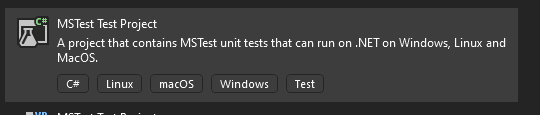

# Writing Unit Tests for cards

**Crazor** has a companion assembly called **Crazor.Test** which implements helper classes/methods to make it super easy to test the logic of your cards. 

To start you create a MSTest test project



## Add Crazor package

>  NOTE: Currently Crazor is only published to an internal Microsoft devops nuget feed.  To connect to this feed, add a **nuget.config** in the root of your project with the following:

```xml
<?xml version="1.0" encoding="utf-8"?>
<configuration>
  <packageSources>
    <clear />
    <add key="Crazor" value="https://fuselabs.pkgs.visualstudio.com/c861868a-1061-43d1-8232-ed9ab373867c/_packaging/Crazor/nuget/v3/index.json" />
  </packageSources>
</configuration>
```

Then you can add the **crazor.test** package

```shell
nuget add package crazor.test
```

# Modifications to your Web Project

1. Edit the .csproj to make it a aspnetcore project change ```<Project Sdk="Microsoft.NET.Sdk">``` to ``` <Project Sdk="Microsoft.NET.Sdk.Web">```

   ```c#
   <Project Sdk="Microsoft.NET.Sdk.Web">
   ```

2. add a **Cards** folder (should be a peer to **Pages** folder)

3. add  **Cards/_ViewImports.cshtml** file containing this:

   ```C#
   @using AdaptiveCards
   @using Crazor
   @using Crazor.Exceptions
   @using Crazor.Attributes
   @using System.Threading;
   @using System.Threading.Tasks;
   @using System.ComponentModel.DataAnnotations
   @removeTagHelper *, Microsoft.AspNetCore.Mvc.TagHelpers
   @removeTagHelper *, Microsoft.AspNetCore.Mvc.Razor
   @addTagHelper *, Crazor
   @addTagHelper *, {YOUR ASSEMBLY NAME HERE}
   ```

# Creating a unit test

Now we will create a card and write a unit tests against the card.

## Create a test card Foo

1. Create a test card folder in **cards/Foo**

2. Create a **Default.cshtml** file in it

   ```html
   @inherits CardView
   <Card Version="1.5">
   	<TextBlock>Counter=@Counter</TextBlock>
       <Action.Execute Verb="@nameof(OnSubmit)"/>
   </Card>
   
   @functions {
   	public int Counter {get;set;}
   
   	public void OnSubmit() => Counter++;
   }
   ```

3. Now create a unit test for it by creating a .cs file called TestFoo.cs and deriving your class for **CardTest**

   ```c#
   using AdaptiveCards;
   using Crazor.Test;
   using Crazor.Test.MSTest;
   
   namespace MyTests
   {
       [TestClass]
       public class TestFoo : CardTest
       {
           [TestMethod]
           public async Task TestIncrementCounter()
           {
               // create an instance of the card by binding to it's route.
               await LoadCard("/Cards/Foo")
                   	// add assertion against the card
                       .AssertTextBlock("Counter=0")
                   // submit an action
                   .ExecuteAction("OnSubmit")
                   	// write assertions agains the card that is returned
                       .AssertTextBlock("Counter=1");
           }
       }
   }
   ```

That's it! The pattern is essentially that you 

* use **LoadCard(route)** to instantiate a card.  
  * You write assertions against the card 
* call **ExecuteAction()** to send input into the card.
  * You write assertions against the card 

| Method                        | Description                                                  |
| ----------------------------- | ------------------------------------------------------------ |
| **LoadCard(route)**           | Load a card                                                  |
| **ExecuteAction(verb, data)** | Invoke a verb (mimic a button click on an action).  You can pass any arbitrary data payload to simulate input |

## Assertion Methods

| Method                             | Description                                                  |
| ---------------------------------- | ------------------------------------------------------------ |
| **AssertTextBlock(text)**          | Assert there is a textblock with a text value                |
| **AssertTextBlock(id, text)**      | Assert that TextBlock with Id has a text value               |
| **AssertNoTextBlock(text)**        | Assert that there is no TextBlock with a text value          |
| **AssertHas<T>()**                 | Assert there is an element of type T in the card             |
| **AssertHas<T>(id)**               | Assert there is an element of type T with id in the card     |
| **AssertHasNo<T>()**               | Assert there is no element of type T in the card             |
| **AssertHasNo<T>(id)**             | Assert there is no element of type T with id in the card.    |
| **AssertElement<T>(id, callback)** | Find Element of type T and id and pass to the callback for custom assertion. |
| **AssertElements<T>(callback)**    | Find all elements of type T and pass to the callback for custom assertion |
| **AssertCard(callback)**           | call callback with the card for custom assertions.           |


### Writing a custom assertion extension

All of the assertion methods are extensions to **Task<CardTestContext>**, so it is easy to create your own assertion helpers.

Here is the implementation of **AssertTextBlock**.  You can see that you await the task to get the context.  The context has

* **Card** - the adaptive card 
* **Services** - The dependency injection services provider.

And it always returns the context back out so that the assertions can be chained together in a fluent style.

``` C#
public static async Task<CardTestContext> AssertTextBlock(this Task<CardTestContext> contextTask, string id, string text)
{
    var context = await contextTask;
    var actual = context.Card.GetElements<AdaptiveTextBlock>().SingleOrDefault(el => el.Id == id)?.Text;
    Assert.AreEqual(text, actual, $"TextBlock[{id}] Expected:'{text}' Actual:'{actual}'");
    return context;
}
```

